---

## About Me

I build intelligent software systems that connect **machine learning**, **backend engineering**, and **product-facing interfaces** into one coherent experience.

- 🧠 **Applied ML & deep learning** — plant genomics, disease detection, explainable surrogate models
- 👁️ **Computer vision** — real-time hand tracking, gesture recognition and AR interaction
- ⚡ **Real-time systems** — WebSocket streaming, Redis, observability dashboards
- 🧩 **Full-stack AI products** — FastAPI / Django backends with React and Flutter frontends
- 📚 **RAG & NLP** — knowledge-grounded assistants and workflow automation

I care about systems that are technically credible *and* actually usable: clean APIs, interpretable ML, and interfaces that make complex outputs feel actionable.

---

## Featured Projects

  
  
  
  
  
  

### Project Highlights

| Project | What it does | Stack |
| --- | --- | --- |
| [Deep-Learning-Plant-DNA-Optimization](https://github.com/MelekCreed/Deep-Learning-Plant-DNA-Optimization) | Plant disease detection, crop DNA optimization, IoT agronomy analytics and genomic decision support | Python, Deep Learning, FastAPI, Flutter |
| [AI-Driven-Therapeutic-Protein-Plant-Synthesis](https://github.com/MelekCreed/AI-Driven-Therapeutic-Protein-Plant-Synthesis) | Plant-host-aware protein DNA optimization with grouped surrogate modeling, explainability and decision dashboards | Python, Streamlit, scikit-learn, XGBoost, SHAP |
| [Real-Time-Payment-Observability-Dashboard](https://github.com/MelekCreed/Real-Time-Payment-Observability-Dashboard) | Privacy-safe live payment monitoring with synthetic replay and guarded analytics | FastAPI, React, TypeScript, WebSockets, Redis |
| [Telekinesis-CV](https://github.com/MelekCreed/Telekinesis-CV) | Hand-controlled AR playground with gesture recognition and custom physics | Python, OpenCV, MediaPipe |
| [Festy-Event](https://github.com/MelekCreed/Festy-Event) | Event booking platform with QR tickets, venue maps, availability calendar, PDF invoices and admin analytics | Django, Leaflet, Chart.js, WeasyPrint |
| [LogiXpress-WebSite](https://github.com/MelekCreed/LogiXpress-WebSite) | Logistics platform with delivery tracking, packaging workflows, notifications and AI-assisted modules | PHP, MySQL, Firebase, Python |

---

## Tech Stack

| Area | Tools |
| --- | --- |
| AI / ML | PyTorch, TensorFlow, scikit-learn, XGBoost, SHAP, pandas, NumPy |
| Computer Vision | OpenCV, MediaPipe |
| AI Product Patterns | RAG, NLP workflows, explainable ML, analytics dashboards |
| Backend | FastAPI, Django, REST APIs, WebSockets, Redis |
| Frontend & Mobile | React, TypeScript, JavaScript, Flutter |
| Data & Storage | PostgreSQL, MySQL, Firebase |
| Delivery | Git, GitHub Actions, Docker |

---

## GitHub Analytics

  
  

  

  

Stats, language and project cards are generated daily by a GitHub Action in this repo.

---

## What I Am Building Next

- Smarter RAG-driven experiences with strong retrieval quality and practical UX
- AI-first full-stack applications where backend intelligence directly shapes the interface
- Real-time computer vision and streaming systems that run reliably outside the notebook
- NLP and HR Tech workflows that automate real business decisions

---

## Contact

